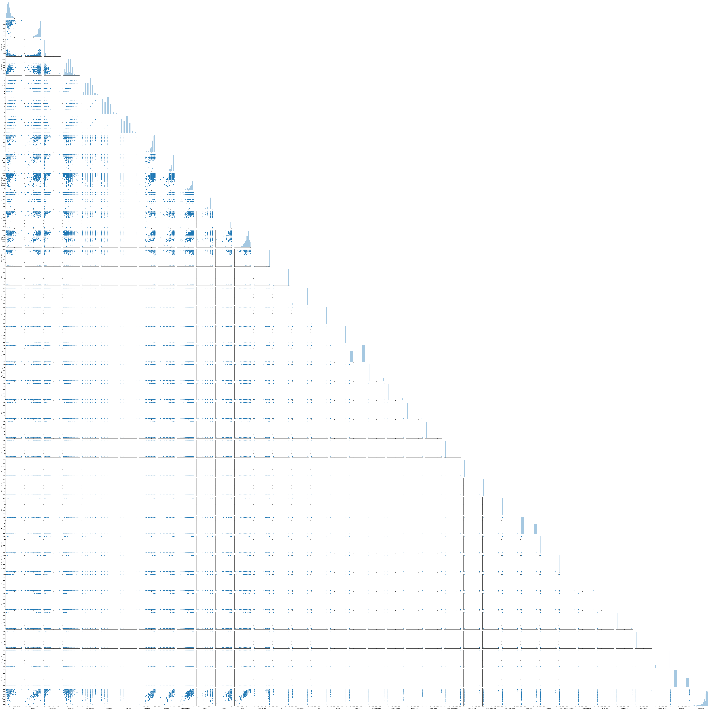

## Predict Airbnb Rental Price

The goal of this project is to understand which features are most important in impacting Airbnb rental price in Lake Tahoe, in order to help hosts improve their rental properties and Airbnb profiles.

To start exploring this goal, I started from calculating the correlation matrix to identify features are highly correlated with my target variable (price), also try to capture possible collinearity.

I used a linear regression model with all features available in my web scraping dataset to predict the rental price.

Below is the performance of my base model:

And the R^2 of the test data is 0.47, thus more improvement are needed in this model.
