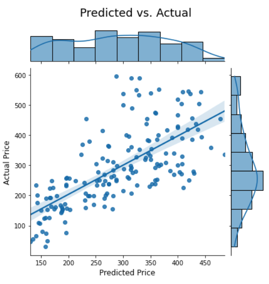

# Linear Regression: Airbnb Rental Price

## Analysis Summary:
The goal of this project is to train a linear regression model to identify features that are highly correlated with rental price on Airbnb, 
in order to help Airbnb hosts understand which property features could help to ask for higher rental price. 
The data I worked contains active listings in Lake Tahoe. The dataset contains rental price as the target variable, and some basic listing features such as property regions, number of bedrooms, number of bathrooms, and property types etc.
The final linear regression model was applied Lasso Regularization to help with feature selections, and RMSE was calcualted to evaluate model performance. 

## Data Description:
The dataset contains 1,261 unique active listings in Lake Tahoe and 27 features. 

## Algorithms
**Feature Engineering**
1. Combined various property types into 3 major categories: House, Condo and Others to reduce the number of features and model complexity.
2. Based distance to the Lake Tahoe, the region attribute was manually mapped into: regions_by_lake and other_regions to reduce the number of features and model complexity.
3. Recalculated ratings scores by using avrage scores across 'cleanliness','accuracy','communication','value','checkin' because of the collinearity

**Model Performance**
Adjusted R^2: 0.59\
RMSE: 91.69

#### Tools:
* Python3 BeautifulSoup + Selenium
